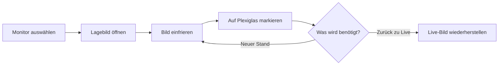
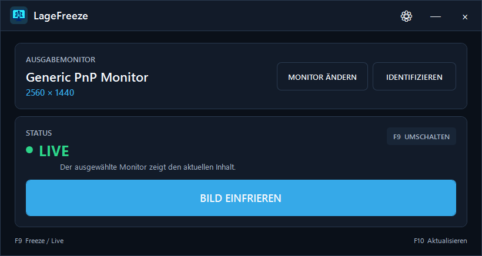
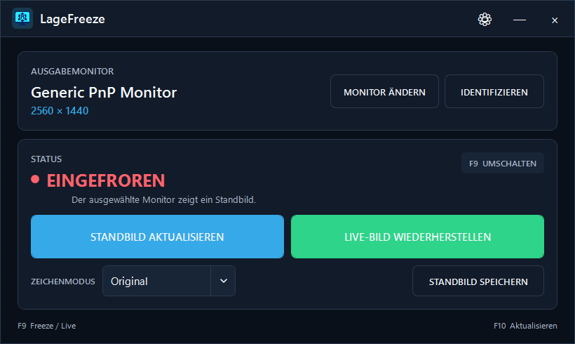

<div align="center">

  

  <h1>LageFreeze</h1>

  <p><strong>Ein Monitor. Ein stabiles Lagebild. Jederzeit zurück zu Live.</strong></p>

  <p>
    LageFreeze friert den sichtbaren Inhalt eines ausgewählten Windows-Monitors<br>
    pixelgenau als randloses Standbild ein. Desktop und Anwendungen laufen im
    Hintergrund normal weiter.
  </p>

  <p>
    <a href="https://github.com/thisislennard/LageFreeze/actions/workflows/build.yml"></a>
    <a href="https://github.com/thisislennard/LageFreeze/releases/latest"></a>
    
    
  </p>

  <p>
    <a href="https://github.com/thisislennard/LageFreeze/releases/latest/download/LageFreeze-Setup-x64.exe"><strong>Installer herunterladen</strong></a>
    · <a href="https://github.com/thisislennard/LageFreeze/releases/latest/download/LageFreeze-Portable-x64.zip">Portable ZIP</a>
    · <a href="https://github.com/thisislennard/LageFreeze/releases/latest">Release ansehen</a>
  </p>

</div>

---

## Wofür ist LageFreeze gedacht?

Auf einem externen Monitor kann eine Karte, ein Lageplan oder ein anderes
Führungsmittel angezeigt werden. Liegt davor eine transparente Plexiglasscheibe,
lassen sich darauf mit Whiteboard-Markern taktische Informationen ergänzen.

Damit diese Markierungen nicht durch einen unerwarteten Bildwechsel ihre
Bedeutung verlieren, legt LageFreeze ein Standbild über genau diesen Monitor.
Der eigentliche Desktop bleibt aktiv und ist mit einem Tastendruck wieder live.

> [!NOTE]
> LageFreeze verändert weder den Grafiktreiber noch die Windows-Anzeigeeinstellungen.
> Der Freeze ist ein lokales Vollbildfenster, das beim Wechsel zu Live oder beim
> Beenden vollständig entfernt wird.

## So funktioniert es



1. Außenmonitor auswählen und bei Bedarf über die eingeblendeten Nummern
   identifizieren.
2. Lagebild in der gewünschten Anwendung öffnen und **BILD EINFRIEREN** drücken.
3. Auf der Plexiglasscheibe markieren.
4. Mit **STANDBILD AKTUALISIEREN** einen neuen Stand übernehmen oder mit
   **LIVE-BILD WIEDERHERSTELLEN** zum aktuellen Bild zurückkehren.

Der optionale `EINGEFROREN`-Hinweis wird beim Aktualisieren ausgeblendet und
nicht dauerhaft in das Standbild oder einen PNG-Export übernommen.

## Ein Blick in die Anwendung

<p align="center">
  
  <br>
  <sub><strong>Live:</strong> Zielmonitor prüfen und das aktuelle Bild mit einer Aktion einfrieren.</sub>
</p>

<p align="center">
  
  <br>
  <sub><strong>Eingefroren:</strong> Standbild aktualisieren, Live-Bild wiederherstellen oder lokal speichern.</sub>
</p>

## Funktionen

| Bereich | Das bietet LageFreeze |
| --- | --- |
| **Freeze & Live** | Pixelgenaues Standbild, sichere Aktualisierung des echten Hintergrundinhalts und sofortige Rückkehr zum Live-Bild |
| **Monitor & DPI** | Auswahl, Wiedererkennung und Identifikation von Displays sowie Unterstützung unterschiedlicher Auflösungen, Anordnungen und Skalierungen |
| **Schnelle Bedienung** | Große touchfreundliche Aktionen, globale konfigurierbare Hotkeys und System-Tray-Menü |
| **Darstellung & Export** | Drei Zeichenmodi, positionierbarer `EINGEFROREN`-Hinweis und lokaler PNG-Export |
| **Windows-Integration** | Installer oder portable Variante, optionaler Autostart, minimierter Start und kontrolliertes Verhalten beim Schließen |
| **Lokal & nachvollziehbar** | Keine Cloud, Telemetrie oder Benutzerverfolgung; verständliche Fehlermeldungen und lokale Tageslogs |

## Download und Installation

| Paket | Empfehlung | Download |
| --- | --- | --- |
| `LageFreeze-Setup-x64.exe` | Für den normalen Einsatz mit Startmenüeintrag | [Installer herunterladen](https://github.com/thisislennard/LageFreeze/releases/latest/download/LageFreeze-Setup-x64.exe) |
| `LageFreeze-Portable-x64.zip` | Zum Testen oder für den Start aus einem eigenen Ordner | [Portable ZIP herunterladen](https://github.com/thisislennard/LageFreeze/releases/latest/download/LageFreeze-Portable-x64.zip) |
| `SHA256SUMS.txt` | Zum Prüfen der heruntergeladenen Dateien | [Prüfsummen herunterladen](https://github.com/thisislennard/LageFreeze/releases/latest/download/SHA256SUMS.txt) |

### Voraussetzungen

- Windows 10 oder Windows 11
- x64-Prozessor
- ein zusätzlicher Monitor für den vorgesehenen Anwendungsfall
- keine separate .NET-Installation bei Verwendung eines Release-Downloads

### Installer

1. Installer aus dem [neuesten stabilen Release](https://github.com/thisislennard/LageFreeze/releases/latest)
   herunterladen und starten.
2. Optional eine Desktop-Verknüpfung anlegen lassen.
3. LageFreeze über das Startmenü öffnen und den gewünschten Außenmonitor wählen.

Der Installer installiert LageFreeze für den aktuellen Benutzer. Eine neuere
Installer-Version kann direkt als Update eingespielt werden. Lokale Einstellungen
und Logs bleiben bei der Deinstallation bewusst erhalten.

Für die portable Variante das ZIP-Archiv in einen eigenen Ordner entpacken und
`LageFreeze.exe` starten.

> [!WARNING]
> Anwendung und Installer sind derzeit nicht mit einem vertrauenswürdigen
> Code-Signing-Zertifikat signiert. Windows kann deshalb beim ersten Start einen
> SmartScreen-Hinweis anzeigen. Downloads sollten nur aus dem offiziellen Release
> stammen und bei Bedarf mit `SHA256SUMS.txt` geprüft werden.

## Bedienung und Einstellungen

| Funktion | Standard |
| --- | --- |
| Freeze / Live umschalten | `F9` |
| Standbild aktualisieren | `F10` |

Die Hotkeys können geändert oder deaktiviert werden. Ist eine Taste bereits von
einer anderen Anwendung belegt, bleibt LageFreeze vollständig über das
Hauptfenster und das optionale Tray-Menü bedienbar.

Unter **EINSTELLUNGEN** lassen sich unter anderem festlegen:

- Standardmonitor, Autostart und minimierter Start
- System-Tray und Verhalten beim Schließen
- Hotkeys und Zeichenmodus
- Screenshot-Ordner
- Sichtbarkeit und Position des `EINGEFROREN`-Hinweises

Wird der aktive Zielmonitor getrennt, beendet LageFreeze den Freeze und stellt
das Live-Bild wieder her. Anschließend kann ein neuer Zielmonitor ausgewählt
werden.

## Für den Einsatz vorbereitet

> [!IMPORTANT]
> LageFreeze ist ein Hilfsmittel zur Darstellung von Bildschirminhalten und kein
> sicherheitskritisches Einsatzführungssystem. Vor dem operativen Einsatz muss
> die konkrete Zielumgebung – insbesondere Monitoranordnung, DPI-Skalierung,
> Hotkeys und Wiederanlauf – anhand der
> [manuellen Testmatrix](docs/manual-testing.md) geprüft werden.

Automatisierte Tests und die durchgeführten Smoke-Checks sichern die
Softwarebasis ab. Die [Roadmap](docs/roadmap.md) dokumentiert den aktuellen
Validierungsstand und noch offene Hardwarekonfigurationen.

## Datenschutz

Bildschirminhalte, Einstellungen und Logs bleiben auf dem Gerät. LageFreeze
benötigt keine Internetverbindung und enthält keine Cloud-Anbindung, Analytics,
Telemetrie oder Benutzerverfolgung. Logs liegen unter
`%LOCALAPPDATA%\LageFreeze\Logs\` und sollten vor einer Supportanfrage geprüft
und bei Bedarf geschwärzt werden.

<details>
<summary><strong>Entwicklung und Projektdokumentation</strong></summary>

### Lokal bauen

Benötigt werden Windows 10/11 und das
[.NET 8 SDK](https://dotnet.microsoft.com/download/dotnet/8.0).

```powershell
git clone https://github.com/thisislennard/LageFreeze.git
cd LageFreeze
dotnet restore LageFreeze.sln
dotnet build LageFreeze.sln --configuration Release --no-restore
dotnet test LageFreeze.sln --configuration Release --no-build
dotnet run --project src/LageFreeze/LageFreeze.csproj
```

### Projektstruktur

```text
src/LageFreeze/          WPF-Anwendung, Modelle und Windows-Dienste
tests/LageFreeze.Tests/  Fokussierte automatisierte Tests
installer/               Inno-Setup-Skript
docs/                    Anforderungen, Architektur und Prüfanleitungen
.github/                 CI, Releases und Beitragsvorlagen
```

### Weiterführende Dokumente

- [Produktanforderungen](docs/product-requirements.md)
- [Technische Leitplanken](docs/architecture.md)
- [Manuelle Testmatrix](docs/manual-testing.md)
- [Release-Prozess](docs/releasing.md)
- [Repository-Einstellungen](docs/repository-settings.md)
- [Beitragen](CONTRIBUTING.md)
- [Sicherheitsmeldungen](SECURITY.md)
- [Changelog](CHANGELOG.md)

Builds und Tests laufen bei Pushes und Pull Requests gegen `main` automatisch.
Ein SemVer-Tag wie `v1.0.1` erzeugt Installer, portable ZIP-Datei und
SHA-256-Prüfsummen.

</details>

## Lizenz

LageFreeze ist unter der [MIT-Lizenz](LICENSE) veröffentlicht.
Copyright © 2026 ThisisLennard.
